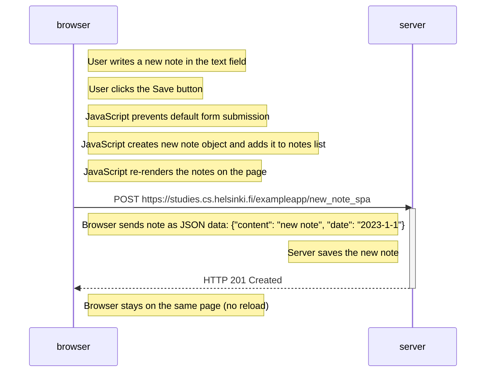

```mermaid
sequenceDiagram
    participant browser
    participant server

    Note right of browser: User writes a new note in the text field
    Note right of browser: User clicks the Save button

    Note right of browser: JavaScript prevents default form submission
    Note right of browser: JavaScript creates new note object and adds it to notes list
    Note right of browser: JavaScript re-renders the notes on the page

    browser->>server: POST https://studies.cs.helsinki.fi/exampleapp/new_note_spa
    activate server
    Note right of browser: Browser sends note as JSON data: {"content": "new note", "date": "2023-1-1"}
    Note left of server: Server saves the new note
    server-->>browser: HTTP 201 Created
    deactivate server

    Note right of browser: Browser stays on the same page (no reload)
```
